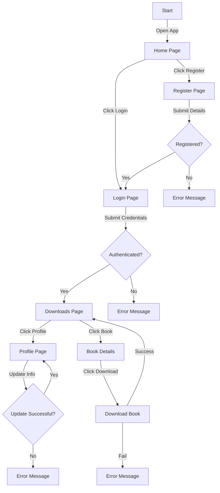

# Ebooks Online

Este projeto é uma aplicação web para download e leitura de ebooks, construída com React e Vite. A aplicação utiliza Chakra UI para estilização, e integra várias funcionalidades como autenticação de usuários, gerenciamento de livros e usuários, e download de ebooks.

## Estrutura do Projeto

A estrutura do projeto é organizada da seguinte forma:

### Principais Diretórios e Arquivos

- `src/`: Contém todo o código fonte da aplicação.
- `api/`: Configuração da API e interceptadores.
- `components/`: Componentes reutilizáveis da aplicação.
- `context/`: Provedores de contexto para gerenciamento de estado global.
- `hooks/`: Hooks personalizados para lógica reutilizável.
- `pages/`: Páginas da aplicação.
- `routes/`: Configuração das rotas da aplicação.
- `services/`: Serviços para comunicação com a API.
- `styles/`: Arquivos de estilo global.
- `theme/`: Configuração do tema da aplicação.
- `utils/`: Funções utilitárias.

## Instalação

Para instalar as dependências do projeto, execute:

```bash
npm install
```

## Scripts Disponíveis

No diretório do projeto, você pode executar:

- `npm run dev`: Executa a aplicação em modo de desenvolvimento. Abra [http://localhost:3000](http://localhost:3000) para visualizar no navegador.
- `npm run build`: Compila a aplicação para produção na pasta `dist`.
- `npm run preview`: Pré-visualiza a aplicação compilada.
- `npm run lint`: Executa o linter para verificar problemas no código.

## Funcionalidades

- **Autenticação de Usuários**: Login, registro e gerenciamento de sessão.
- **Gerenciamento de Usuários**: Edição, exclusão e listagem de usuários.
- **Gerenciamento de Livros**: Upload, edição, exclusão e listagem de livros.
- **Download de Ebooks**: Permite aos usuários baixar ebooks.

## Tecnologias Utilizadas

- **React**: Biblioteca JavaScript para construção de interfaces de usuário.
- **Vite**: Ferramenta de build rápida para desenvolvimento web.
- **Chakra UI**: Biblioteca de componentes para React.
- **Axios**: Cliente HTTP para fazer requisições à API.
- **React Router**: Gerenciamento de rotas na aplicação.
- **Formik**: Biblioteca para construção de formulários em React.
- **Yup**: Biblioteca para validação de formulários.

## Fluxo de Usuário

O diagrama abaixo mostra o fluxo de interação do usuário dentro da aplicação:



Esse diagrama ilustra o fluxo da aplicação, desde o login até o download de ebooks.

## Contribuição

Contribuições são bem-vindas! Sinta-se à vontade para abrir issues e pull requests.
