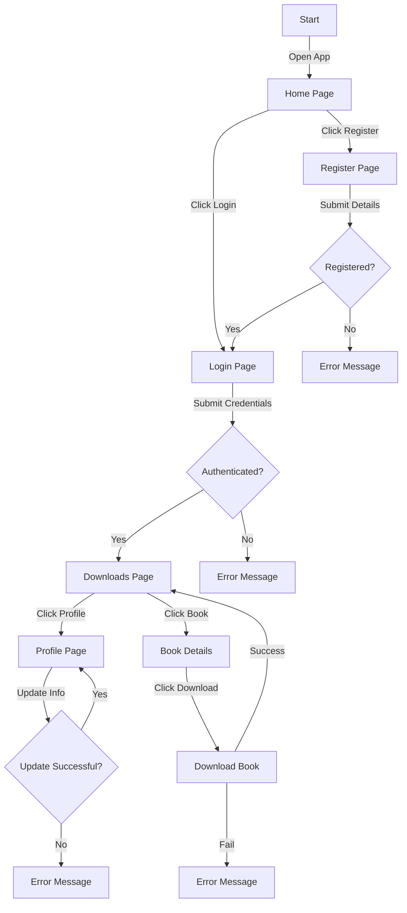

# Livraria de Ebooks Online

**Visite**: [Ebooks Online](https://ebooks-cn24.onrender.com)

Este projeto é uma plataforma de livraria de ebooks online, onde usuários podem navegar e baixar ebooks. Administradores podem gerenciar usuários e ebooks. A plataforma é desenvolvida para ser intuitiva e fácil de usar tanto para leitores quanto para administradores.

## 1. Interface do Usuário (UI)

A interface do usuário é projetada para ser acessível e fácil de usar, dividida nas seguintes seções principais:

### Página Inicial (Home)
- **Visibilidade dos ebooks**: Exibe uma lista de ebooks em destaque ou populares, com imagens de capa, título, autor e uma breve descrição.
- **Busca**: Um campo de busca está disponível para pesquisar por título, autor ou algum termo dos ebooks.
- **Login/Registro**: Um botão de login aparece no canto superior direito para usuários autenticados ou para quem deseja se registrar.

### Modal de Detalhes do Ebook
- **Informações do Livro**: Ao clicar em um ebook, o usuário abre um modal de detalhes, onde são exibidas informações detalhadas como título, autor e resumo.

### Página de Perfil de Usuário
- **Edição de Perfil**: O usuário pode editar suas informações pessoais, como nome, email e senha.
- **Exclusão de Conta**: O usuário pode excluir sua conta a qualquer momento.

### Página de Administração (Para Administradores)
- **Gerenciamento de Usuários**: Administradores visualizam todos os usuários registrados, com a capacidade de editar ou excluir contas.
- **Gerenciamento de Ebooks**: Administradores adicionam, editam ou excluem ebooks da plataforma. Também podem definir títulos e descrições.

## 2. Arquitetura de Dados
A arquitetura de dados utiliza um banco de dados NoSQL MongoDB Atlas na nuvem para armazenar as informações. Aqui estão os componentes principais:

### Entidades Principais
- **Usuário**: Armazena informações sobre os usuários (nome, email, senha criptografada, tipo de usuário - administrador ou usuário comum).
- **Ebook**: Armazena dados dos ebooks (título, autor, descrição).

### Armazenamento de Ebooks
- Os ebooks são armazenados como arquivos em um serviço de armazenamento MongoDB Atlas na nuvem.

### Segurança
- **Autenticação e Autorização**: A plataforma utiliza JWT (JSON Web Tokens) para garantir uma autenticação segura. O administrador possui permissões adicionais para gerenciar usuários e ebooks.
- **Criptografia de Senha**: As senhas dos usuários são armazenadas de forma segura utilizando algoritmos de hashing como bcrypt.

## 3. Público-Alvo

A plataforma atende a diferentes perfis de usuários:

### Leitores de Ebooks
- **Demografia**: Pessoas de todas as idades, especialmente interessadas em literatura digital.
- **Necessidades**: Acesso fácil a ebooks e interface intuitiva.
- **Comportamento**: Preferem ebooks digitais pela conveniência, com interesse por livros de vários gêneros.

### Autores e Editores
- **Demografia**: Autores independentes ou editoras de livros que desejam disponibilizar ebooks online.
- **Necessidades**: Ferramentas para publicar e promover seus livros.
- **Comportamento**: Buscam visibilidade de seus livros digitais.

### Administradores da Plataforma
- **Demografia**: Equipe interna responsável por gerenciar a plataforma.
- **Necessidades**: Ferramentas administrativas para gerenciar usuários e ebooks.
- **Comportamento**: Acesso a funcionalidades de gerenciamento de conteúdo.

## Como Usar

1. Clone o repositório:
   ```bash
   git clone https://github.com/HeloisaFelizardo/livraria-online-app.git
   ```

2. Navegue até o diretório do projeto:
   ```bash
   cd livraria-online-app
   ```

3. Instale as dependências:
   ```bash
   npm install
   ```

4. Inicie o servidor:
   ```bash
   npm run dev
   ```

## Funcionalidades

Este projeto é uma aplicação web para download e leitura de ebooks, construída com React e Vite. A aplicação utiliza Chakra UI para estilização, e integra várias funcionalidades como autenticação de usuários, gerenciamento de livros e usuários, e download de ebooks.

## Estrutura do Projeto

A estrutura do projeto é organizada da seguinte forma:

### Principais Diretórios e Arquivos

- `src/`: Contém todo o código fonte da aplicação.
- `api/`: Configuração da API e interceptadores.
- `components/`: Componentes reutilizáveis da aplicação.
- `context/`: Provedores de contexto para gerenciamento de estado global.
- `hooks/`: Hooks personalizados para lógica reutilizável.
- `pages/`: Páginas da aplicação.
- `routes/`: Configuração das rotas da aplicação.
- `services/`: Serviços para comunicação com a API.
- `styles/`: Arquivos de estilo global.
- `theme/`: Configuração do tema da aplicação.


## Instalação

Para instalar as dependências do projeto, execute:

```bash
npm install
```

## Scripts Disponíveis

No diretório do projeto, você pode executar:

- `npm run dev`: Executa a aplicação em modo de desenvolvimento. Abra [http://localhost:3000](http://localhost:3000) para visualizar no navegador.
- `npm run build`: Compila a aplicação para produção na pasta `dist`.
- `npm run preview`: Pré-visualiza a aplicação compilada.
- `npm run lint`: Executa o linter para verificar problemas no código.

## Funcionalidades

- **Autenticação de Usuários**: Login, registro e gerenciamento de sessão.
- **Gerenciamento de Usuários**: Edição, exclusão e listagem de usuários.
- **Gerenciamento de Livros**: Upload, edição, exclusão e listagem de livros.
- **Download de Ebooks**: Permite aos usuários baixar ebooks.

## Tecnologias Utilizadas

- **React**: Biblioteca JavaScript para construção de interfaces de usuário.
- **Vite**: Ferramenta de build rápida para desenvolvimento web.
- **Chakra UI**: Biblioteca de componentes para React.
- **Axios**: Cliente HTTP para fazer requisições à API.
- **React Router**: Gerenciamento de rotas na aplicação.
- **Formik**: Biblioteca para construção de formulários em React.
- **Yup**: Biblioteca para validação de formulários.

## Fluxo de Usuário

O diagrama abaixo mostra o fluxo de interação do usuário dentro da aplicação:



Esse diagrama ilustra o fluxo da aplicação, desde o login até o download de ebooks.

## Contribuição

Contribuições são bem-vindas! Sinta-se à vontade para abrir issues e pull requests.
